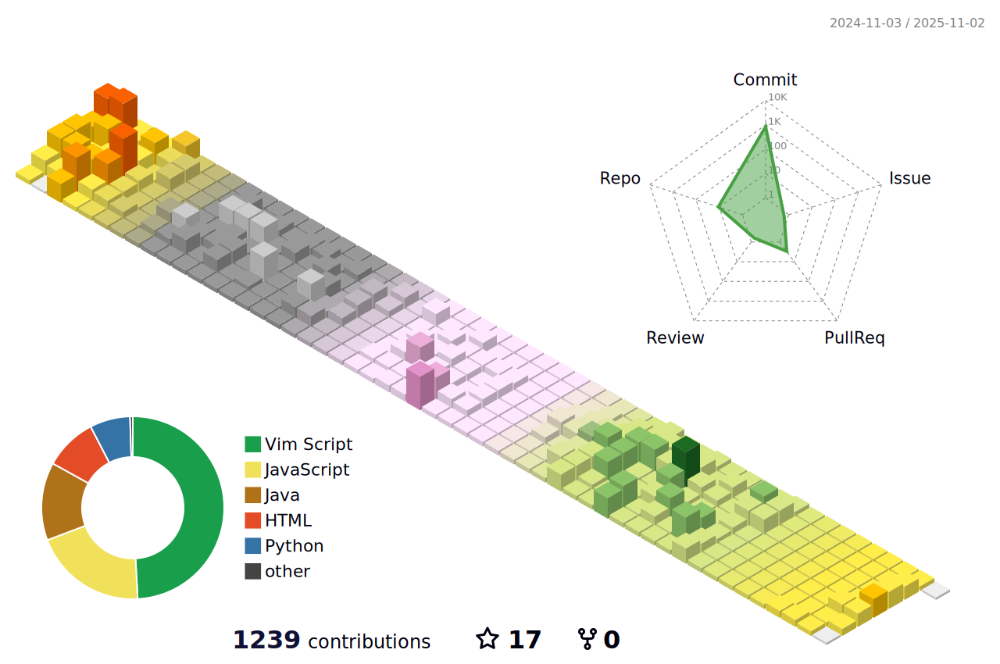

  <!-- 1. Tech Stacks -->
  

    <h1>🚀 Tech Stacks</h1>
    <!-- Languages -->
    
    
    
    
     
    <!-- Frameworks & Libraries -->
    
    
    
    
     
    <!-- Databases -->
    
    
    
    
     
    <!-- Infrastructure -->
    
    
    
    
    
    
     
    
    
    
    
    
     
    <!-- Tools -->
    
    
    
    
     
    
    
    
  

   

  <!-- 2. Contributions -->
  <!-- 

    <h1>🎯 Contributions</h1>
    
  

    -->

  <!-- 3. My Farm -->
  

    <h1>🏡 My Farm</h1>
    
  

